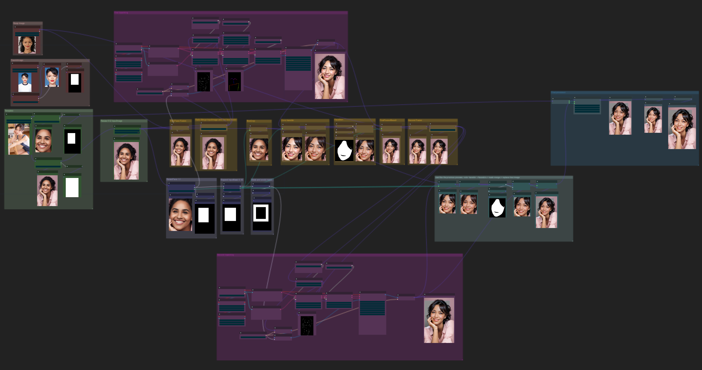

# [Portrait-Maker](https://github.com/THtianhao/ComfyUI-Portrait-Maker)
This project is an adaptation of [EasyPhoto](https://github.com/aigc-apps/sd-webui-EasyPhoto), which breaks down the process of [EasyPhoto](https://github.com/aigc-apps/sd-webui-EasyPhoto) and will add a series of operations on human portraits in the future.


English | [简体中文](./README_zh-CN.md)

## Installation
**Note: When you start the plugin for the first time, it will download all the models required by EasyPhoto. You can see the download progress in the terminal. Please do not interrupt the download (no hash verification for startup speed). If the download is interrupted, you need to manually delete the files downloaded halfway last time and download them again.**

1. First, install ComfyUI.

2. After ComfyUI runs successfully, go to the `custom_nodes` directory `ComfyUI/custom_nodes/`

```
cd custom_nodes
```

3. Clone this project into the custom_nodes directory.

```
git clone https://github.com/THtianhao/ComfyUI-Portrait-Maker.git
```

4. Restart ComfyUI.

## Dependent Plugin

[comfyui_controlnet_aux](https://github.com/Fannovel16/comfyui_controlnet_aux)

To install the dependent plugin, go to the `custom_nodes` in the same way as installing this plugin, and then execute the following:

```
git clone https://github.com/Fannovel16/comfyui_controlnet_aux.git
```

Note: This dependency is for viewing the style of openpose.

## ComfyUI Workflow
Easyphoto workflow location: [./workflow/easyphoto.json](./workflows/easyphoto.json)

Click "Load" in the right panel of ComfyUI and select the ./workflow/easyphoto_workflow.json file from the project.


## Node Introduction

* RetainFace PM: Processes images using the pipeline `damo/cv_resnet50_face-detection_retinaface` from Model Scope
    * image: Input image
    * multi_user_facecrop_ratio: Multiple for extracting the face area
* FaceFusion PM: Fuses two images using the pipeline `damo/cv_unet-image-face-fusion_damo` from Model Scope
    * image: Input image
    * user_image: Image to be fused
* RatioMerge2Image PM: Merges two images according to a ratio
    * image1: Input image
    * Image2: Input image
    * fusion_rate: Fusion ratio, maximum is 1, larger values lean towards image1
* MaskMerge2Image PM: Merges images using a mask
    * image1: Input image
    * image2: Input image
    * mask: Mask to be replaced
* ReplaceBoxImg PM: Replaces the image in a box area
    * origin_image: Original image
    * box_area: Area
    * replace_image: Image to be replaced in the area (resolution of box_area and replace_image must match)
* ExpandMaskFaceWidth PM: Proportionally expands the width of the mask
    * mask: Input mask
    * box: Box corresponding to the mask
    * expand_width: Width expansion ratio based on the width of the box
* BoxCropImage PM: Crops images using a box
* ColorTransfer PM: Color transfer for images
* FaceSkin PM: Extracts the mask of the facial part of the image
* MaskDilateErode PM: Dilates and erodes the mask
* SkinRetouching PM: Processes images using the pipeline `damo/cv_gpen_image-portrait-enhancement` from Model Scope
* PortraitEnhancement PM: Processes images using the pipeline `damo/cv_gpen_image-portrait-enhancement` from Model Scope
* ImageResizeTarget PM: Resizes images to a target width and height
* ImageScaleShort PM: Reduces the width and height of the image's shorter side
    * image: Input image
    * size: Length to be scaled (proportionally scaled based on the shorter side of width and height)
    * crop_face: Width and height must be multiples of 32 after scaling
* GetImageInfo PM: Extracts the width and height of the image

## Contribution

If you find any issues or have suggestions for improvement, feel free to contribute. Follow these steps:

1. Create a new feature branch: `git checkout -b feature/your-feature-name`
2. Make changes and commit: `git commit -m "Add new feature"`
3. Push to your remote branch: `git push origin feature/your-feature-name`
4. Create a Pull Request (PR).

## License

This project is licensed under the MIT License. See the [LICENSE](LICENSE) file for more information.

## Contact

If you have any questions or suggestions, you can reach us through:

- Email: tototianhao@gmail.com
- QQ Group: 10419777
- WeChat Group: 

Feel free to join us and contribute to the development of the EasyPhoto ConfyUI Plugin!
