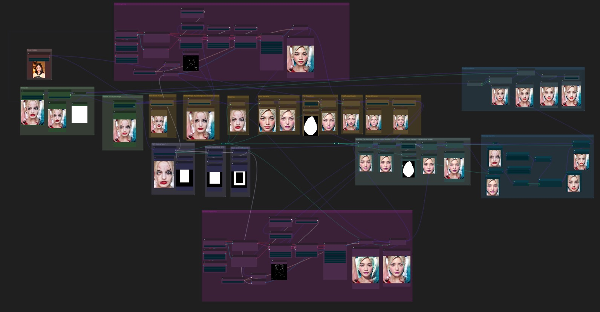

# [Portrait-Maker](https://github.com/THtianhao/ComfyUI-Portrait-Maker)
This project is an adaptation of [EasyPhoto](https://github.com/aigc-apps/sd-webui-EasyPhoto), which breaks down the process of [EasyPhoto](https://github.com/aigc-apps/sd-webui-EasyPhoto) and will add a series of operations on human portraits in the future.


English | [简体中文](./README_zh-CN.md)

## Community

If you have any questions or suggestions, you can reach us through:

- Email: tototianhao@gmail.com
- telegram: https://t.me/+JoFE2vqHU4phZjg1
- QQ Group: 10419777
- WeChat Group: 

## V1.1.0 Update
1. faceskin adds blur option
2. Add PM_FaceShapMatch node. same as easyphot faceshap match
3. Add PM_MakeUpTransfer node. same as easyphoto makeup transfer.
4. Add a super-resolution model to the PM_PortraitEnhancement node. This super-resolution model can not highlight faces.
5. Add v1.1.0 workflow
6. RetinaFace supports face selection

## V1.0.0 Update
1. Added log for model downloads.
2. Renamed nodes to resolve conflicts with other plugins.
3. Added "roop" model to the Facefusion PM node.
4. Updated the workflow.
5. Speed up the second model loading

## Currently Resolving
1. Contacting modelscope to address Windows dependency issues.


## Installation
**Note: When you start the plugin for the first time, it will download all the models required by EasyPhoto. You can see the download progress in the terminal. Please do not interrupt the download (no hash verification for startup speed). If the download is interrupted, you need to manually delete the files downloaded halfway last time and download them again.**

### For Windows users

If you are using a project extracted from a zip package while using ComfyUI, you won't be able to use this plugin. This project relies on ModelScope, but the virtual environment provided in the official ComfyUI zip package cannot install ModelScope. Furthermore, the ComfyUI author has responded, stating that this issue cannot be resolved.[aliyunsdkcor error](https://github.com/ltdrdata/ComfyUI-Impact-Pack/issues/223) If Windows users wish to use this plugin for analyzing and composing ComfyUI workflows, they will need to create their own virtual environment. (I am using Python 3.10.6.).Of course, if you know a solution, feel free to submit a pull request (PR).

### install step
1. First, install ComfyUI.

2. After ComfyUI runs successfully, go to the `custom_nodes` directory `ComfyUI/custom_nodes/`

```
cd custom_nodes
```

3. Clone this project into the custom_nodes directory.

```
git clone https://github.com/THtianhao/ComfyUI-Portrait-Maker.git
```

4. Restart ComfyUI.


## ComfyUI Workflow
Easyphoto workflow location: [./workflow/easyphoto.json](./workflows/easyphoto.json)

Click "Load" in the right panel of ComfyUI and select the ./workflow/easyphoto_workflow.json file from the project.


## Node Introduction

* RetainFace PM: Perform matting using models from Model Scope. [Link](https://www.modelscope.cn/models/damo/cv_resnet50_face-detection_retinaface/summary)
  * image: Input image
  * multi_user_facecrop_ratio: Multiplicative factor for extracting the head region.
  * face_index : Choose which face

* FaceFusion PM: Merge faces from two images.
  * image: Input image
  * user_image: The image with the face to be merged.
  * model: Choose between Ali's model or Roop's model for merging.
    * ali: [Link](https://www.modelscope.cn/models/damo/cv_unet-image-face-fusion_damo/summary)
    * roop: [Link](https://github.com/deepinsight/insightface)

* RatioMerge2Image PM: Merge two images according to a specified ratio.
  * image1: First input image
  * image2: Second input image
  * fusion_rate: Fusion ratio, ranging from 0 to 1, where higher values favor image1.

* MaskMerge2Image PM: Merge images using a mask.
  * image1: First input image
  * image2: Second input image
  * mask: The mask to be applied for replacement.

* ReplaceBoxImg PM: Replace the image inside a specified box area.
  * origin_image: The original image
  * box_area: The area to be replaced
  * replace_image: The image to replace (ensure the resolution matches box_area)

* ExpandMaskFaceWidth PM: Proportionally expand the width of the mask.
  * mask: Input mask
  * box: Corresponding box of the mask
  * expand_width: The width expansion ratio, based on the box's width.

* BoxCropImage PM: Crop an image using a box.

* ColorTransfer PM: Perform color transfer on images.

* FaceSkin PM: Extract the mask of the facial region from an image.

* MaskDilateErode PM: Dilate and erode masks.

* Skin Retouching PM: Apply skin retouching using the following model.
  * [Link](https://www.modelscope.cn/models/damo/cv_unet_skin-retouching/summary)

* Portrait Enhancement PM: Process images using the following model.
  * model
    * gpen: [Link](https://www.modelscope.cn/models/damo/cv_gpen_image-portrait-enhancement/summary)
    * real_gan: [Link](https://www.modelscope.cn/models/bubbliiiing/cv_rrdb_image-super-resolution_x2/summary)

* ImageResizeTarget PM: Resize images to a target width and height.

* ImageScaleShort PM: Reduce the smaller dimension of an image proportionally.
  * image: Input image
  * size: Desired length for resizing (maintains the aspect ratio)
  * crop_face: Ensure the resulting width and height are multiples of 32.

* GetImageInfo PM: Extract the width and height of an image.

* Face Shape Match PM: Apply a certain level of fusion between the diffused image and the original image to reduce differences around the face.

* Makeup Transfer PM: Use a GAN network model to perform makeup transfer.
## Contribution

If you find any issues or have suggestions for improvement, feel free to contribute. Follow these steps:

1. Create a new feature branch: `git checkout -b feature/your-feature-name`
2. Make changes and commit: `git commit -m "Add new feature"`
3. Push to your remote branch: `git push origin feature/your-feature-name`
4. Create a Pull Request (PR).

## License

This project is licensed under the MIT License. See the [LICENSE](LICENSE) file for more information.


Feel free to join us and contribute to the development of the EasyPhoto ConfyUI Plugin!
